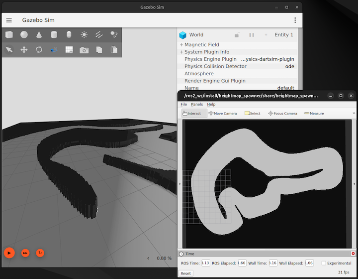

# heightmap_spawner

A ROS 2 package that converts occupancy grids from `nav2_map_server` into 3D heightmap models for use in Gazebo simulations.



## Features
- **Occupancy Grid Conversion**: Converts 2D occupancy grid maps into heightmaps for 3D simulation.
- **Image Processing**: Includes median filtering and color inversion to improve map accuracy.
- **Configurable Thresholds**: Adjustable parameters to control the image-to-heightmap transformation.
- **Gazebo Integration**: Automatically spawns the processed heightmap in Gazebo (gz-sim).

## Dependencies
- **ROS 2**: Required for running the package in a ROS environment.
- **Gazebo (gz-sim)**: The simulation platform where the heightmap models are spawned.
- **Gazebo Transport Library (gz-transport)**: Facilitates communication with Gazebo.
- **OpenCV**: Used for image processing tasks such as filtering and color inversion.
- **nav2_map_server**: Provides the occupancy grid maps to be converted.

## Installation
1. Clone the repository into your ROS 2 workspace:
   ```bash
   git clone https://github.com/your-repository/heightmap_spawner.git
   ```
2. Install required dependencies using `rosdep`:
   ```bash
   rosdep install --from-paths src --ignore-src -r -y
   ```
3. Build the workspace using `colcon`:
   ```bash
   colcon build
   ```

## Usage
### Launching the Example Map
Use the provided launch file to run the example map and see the heightmap spawner in action:
```bash
ros2 launch heightmap_spawner example.launch.py
```

### Launching the Spawner Node
You can also launch the `heightmap_spawner` node directly using the `spawner.launch.py` file or by defining the node in your own launch files.

## Node Arguments
Customize the behavior of the heightmap spawner using the following arguments:

| Argument              | Default Value | Description                                                   |
|-----------------------|---------------|---------------------------------------------------------------|
| `save_path`           | `/tmp`        | The directory where the processed heightmap image is saved.   |
| `height`              | `0.5`         | The vertical height of the spawned heightmap in Gazebo.       |
| `use_median_filtering` | `true`       | Enables median filtering to reduce noise in the heightmap.    |
| `use_color_inverse`   | `true`        | Inverts the colors of the image to adjust height scaling.     |
| `low_thresh`          | `200`         | Lower threshold value for filtering the occupancy grid image. |
| `high_thresh`         | `255`         | Upper threshold value for filtering the occupancy grid image. |

## License
This package is licensed under the MIT License. See the `LICENSE.txt` file for more details.